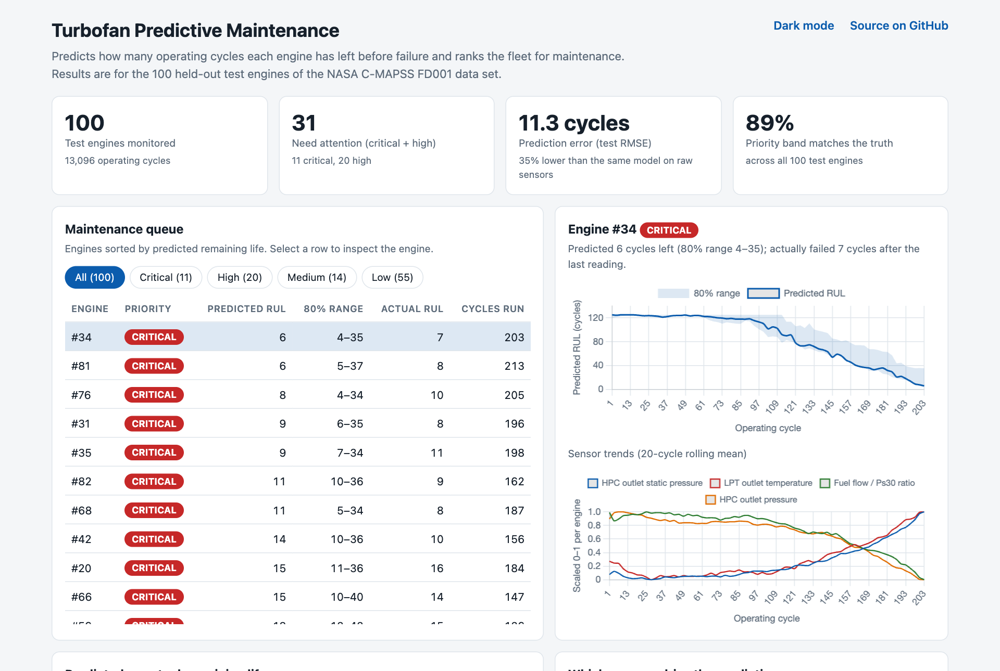
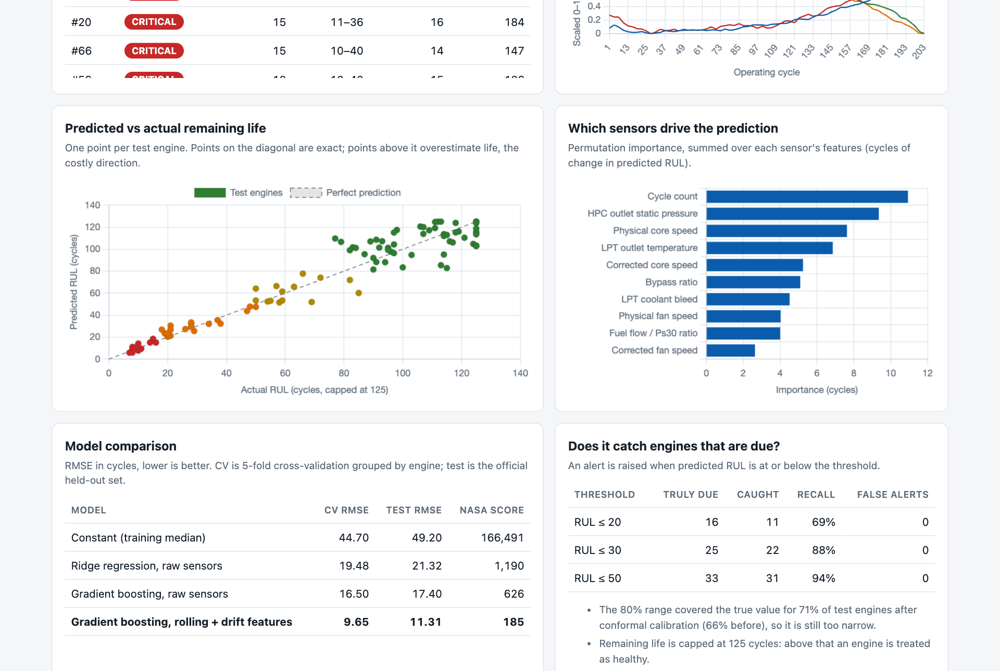

# Turbofan Predictive Maintenance


Predicts the **remaining useful life (RUL)** of jet engines from sensor readings and turns the predictions into a **ranked maintenance queue**.

**Live demo:** https://s-harshni.github.io/Turbofan-Predictive-Maintenance/



## Why

Servicing equipment on a fixed schedule either wastes healthy life or misses failures. Condition-based maintenance uses sensor data to service each machine when it actually needs it. This project builds that decision end to end on a public benchmark: from raw sensor rows to "which engine do we pull first".

## Results

All numbers are measured on the official held-out test set of NASA C-MAPSS FD001 (100 engines, 13,096 operating cycles). Reproduce them with `python run.py`.

| Model | CV RMSE | Test RMSE | NASA score |
| --- | ---: | ---: | ---: |
| Constant (training median) | 44.70 | 49.20 | 166,491 |
| Ridge regression, raw sensors | 19.48 | 21.32 | 1,190 |
| Gradient boosting, raw sensors | 16.50 | 17.40 | 626 |
| **Gradient boosting, rolling + drift features** | **9.65** | **11.31** | **185** |

RMSE is in operating cycles. CV is 5-fold cross-validation grouped by engine, so no engine appears in both the training and validation folds. The NASA score penalises overestimating life more than underestimating it.

- **Feature engineering did most of the work.** The same model on engineered features has 35% lower test error than on raw sensors (17.40 → 11.31).
- **Maintenance alerts.** Alerting when predicted RUL is 30 cycles or less catches 22 of the 25 engines that are truly within 30 cycles of failure (88% recall) with no false alerts. At a threshold of 20 cycles, recall is 69% (11 of 16).
- **Priority bands.** The predicted band (critical, high, medium, low) matches the true band for 89 of 100 engines.
- **Uncertainty.** Each prediction comes with an 80% range from quantile regression, widened by conformal calibration. It covers the true value for 71% of test engines (66% before calibration), so the range is still too narrow and is reported as such.



## How it works

```
raw cycles ──► drop constant sensors ──► per-engine features ──► gradient boosting ──► RUL + 80% range ──► priority band ──► maintenance queue
              (21 → 14 sensors)          (rolling mean, rolling      (squared error and       (conformal          (critical ≤ 20, high ≤ 50,
                                          std, drift from the         10% / 90% quantiles)     calibration)         medium ≤ 80 cycles)
                                          engine's early life)
```

1. **Labels.** Each training engine runs to failure, so RUL is the last cycle minus the current cycle. It is capped at 125 cycles, because an engine early in life shows no degradation to learn from.
2. **Sensor selection.** Seven of the 21 sensors are constant or two-valued in FD001 and are dropped.
3. **Features.** For each remaining sensor: the raw value, a 20-cycle rolling mean and standard deviation, and the *drift* of the rolling mean from the engine's own first 10 cycles. Drift removes engine-to-engine offsets, so the model sees wear and not manufacturing differences.
4. **No leakage.** Every feature uses only the current and earlier cycles of the same engine. Two tests enforce this: truncating an engine's future does not change its past features, and features never mix engines.
5. **Model.** scikit-learn `HistGradientBoostingRegressor`, with two extra quantile models for the range.
6. **Decision.** Predicted RUL maps to a priority band, and the fleet is sorted by it.

## Run it

```bash
python -m venv .venv && source .venv/bin/activate
pip install -r requirements.txt
python run.py                      # trains, evaluates, writes docs/data.json (a few minutes on a laptop CPU)
pytest -q                          # 8 tests
python -m http.server -d docs 8000 # dashboard at http://localhost:8000
```

## Repository layout

```
data/            NASA C-MAPSS FD001 files (unmodified) and attribution
src/pdm/         data.py (loading, labels) · features.py · model.py (models, metrics, bands)
run.py           train → evaluate → export
tests/           data integrity, label, leakage and metric tests
docs/            static dashboard (GitHub Pages) and data.json
```

## Limitations

- C-MAPSS is **simulated** data from NASA's engine model, not readings from engines in service.
- FD001 has one operating condition and one fault mode. The harder subsets (FD002–FD004) are not covered.
- The priority bands and the 125-cycle cap are project assumptions, not an industry standard.
- The uncertainty range under-covers (71% against a nominal 80%).
- Results come from a single random seed.

## Data

A. Saxena, K. Goebel, D. Simon, N. Eklund, "Damage Propagation Modeling for Aircraft Engine Run-to-Failure Simulation", PHM08, 2008. NASA Ames Prognostics Center of Excellence. See [`data/README.md`](data/README.md).
